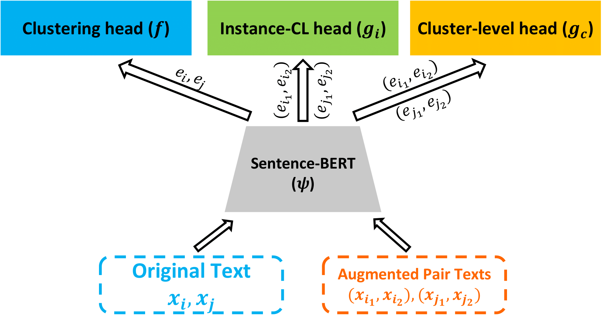

# Improved Supporting Clustering with Contrastive Learning (ISCCL)

>  This repository is the improved version of paper [Supporting Clustering with Contrastive Learning (NAACL 2021)](https://aclanthology.org/2021.naacl-main.427.pdf)
<p align="center">
  
</p>


## Getting Started

### Requirements
    python==3.6.13 
    pytorch==1.6.0. 
    sentence-transformers==2.0.0. 
    transformers==4.8.1. 
    tensorboardX==2.4.1
    pandas==1.1.5
    sklearn==0.24.1
    numpy==1.19.5


### ISCCL with augmented data

The code for augmentations is in **ISCCL/AugData**, and the processed data are already there.


## Running the model

```python
python3 main.py \
        --resdir $path-to-store-your-results \
        --use_pretrain SBERT \
        --bert distilbert \
        --datapath $path-to-your-data \
        --dataname searchsnippets_trans_subst_20 \
        --num_classes 8 \
        --text text \
        --label label \
        --objective SCCL \
        --augtype explicit \
        --temperature 0.5 \
        --eta 5 \
        --lr 5e-05 \
        --lr_scale 100 \
        --max_length 32 \
        --batch_size 400 \
        --max_iter 3000 \
        --print_freq 100 \
        --gpuid 0
```


